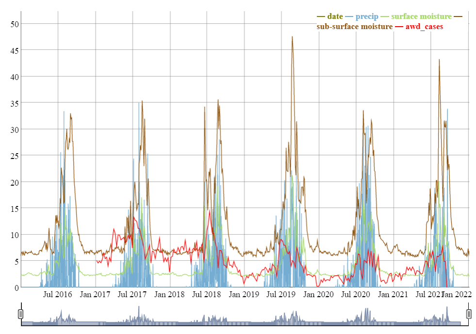
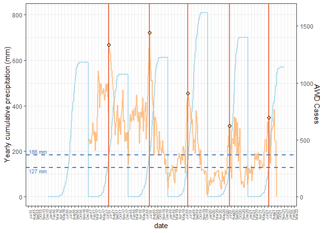

NE Nigeria Climate and Health/Nutrition Analysis
================

<!-- README.md is generated from README.Rmd. Please edit that file -->
<!-- badges: start -->
<!-- badges: end -->

Repository to store analysis of climate and health data in NE in
Nigeria.

Some the initial findings displayed view some [preliminary
investigations
here](https://zackarno.github.io/NE_Nigeria_climate_health/)

## Overview of Data

- Below is a graph showing:
  - precipitation
  - surface soil moisture
  - sub-surface soil moisture
  - AWD cases/100

Could not get dynamic graph to work on GH readme so going with static
screenshot for now:

<!--  -->

## Establishing Environmental Thresholds

- A prominent peak occurs shortly after the start of the rainy season.
- Rainfall generally declines after this initial peak
- Below we have graphed cumulative yearly rainfall against AWD caseload
  - we see that AWD caseloads tend to peak in a narrow band of
    cumulative rainfall

<!-- -->
